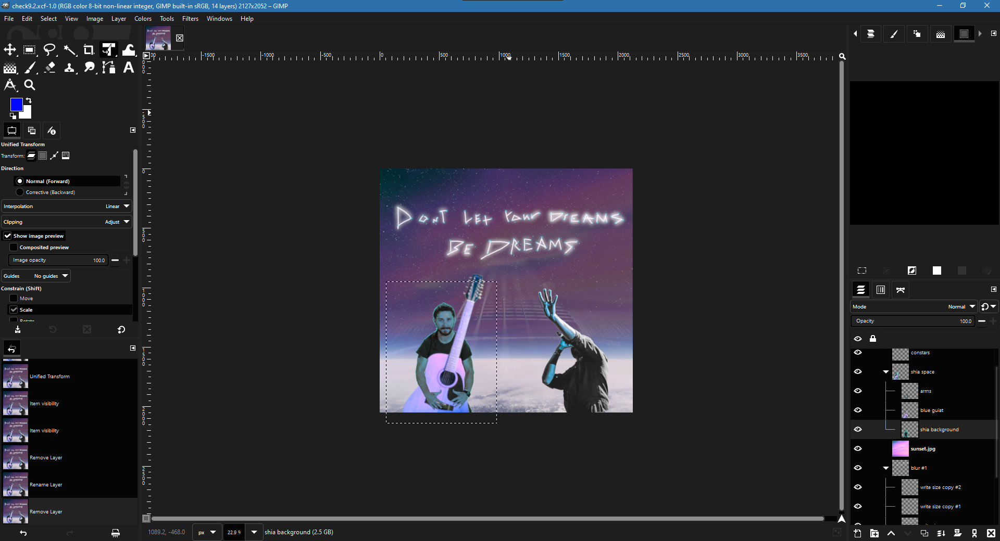
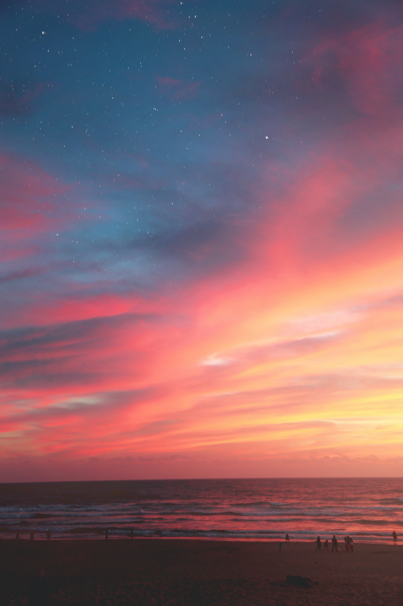
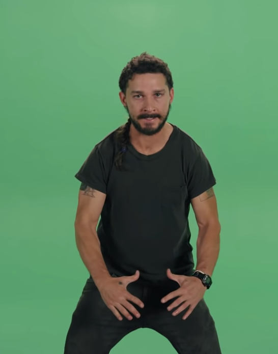

# Don't Let Your Dreams Be Dreams

## A Visual Argument 
This is a visual argument targeted at musicians to not give up on their passions. I personally had a phase where I let myself use the 'not enough time' excuse for not continuing to learn the guitar. Since I recently got back into it, I wanted to help convince others to not forget their passions as well. Shia LaBeouf had a very popular motivational meme back in the day and the message was adjacent to mine, so its context incorporated very nicely into my visual argument. 

With music being the inspiration for my message, I imagined this visual argument to be displayed like an album cover.

 

--------------
## Project Versions
### Version 1

I originally played into a meme theme by making Shia LeBouf look ridiculous but also have a normal image of him in the background to subtly retain a familiarity with the original meme. I decided to create an alternative to this funny version because I wanted this album cover to be more presentable to the people who aren't informed about this old meme. But I still wanted to give this version recognition because it may be a more effective visual argument for an audience that does understand the meme.

 

### Working on Version 2

 

## Reflection
For my visual argument, I went with a celestial space them because the message made me think of ‘shooting for the stars’ and to follow with that I knew that I wanted to use a constellation font. I drew the font myself to get the natural irregularity of star positions and then chroma-shifted GIMP’s sparkle brush tool to make the foreground blue stars. To add emphasis to the font, I duplicated the font layer and blurred the back layer. To get Shia to hold the guitar, I auto-selected his arms and pasted them to a separate layer above the guitar layer. 

In my first version, it felt like images were disconnected from the font and drew attention away from it because the scale and color of the images conflicted with it, so to add Balance, I made the people smaller and point towards the font. And to add consistency and keep a calm non-serious tone, I made everything a blue-purple space color scheme. 

I also added a ghost guitar add depth and subtley draw attention flow in the direction of the font, successfully establishing visual dominance of the quote "Don't let your dreams be dreams". 

The images act as a visual metaphor with the person *reaching for the stars* and Shia LeBouf telling him (and the viewer) "Don't let your dreams be dreams". Overall, I think my final version turned out to be a nicely complete message with a clear message to not give up on your passions.

 

----------
## Credits

Photo by <a href="https://unsplash.com/@danesduet?utm_source=unsplash&utm_medium=referral&utm_content=creditCopyText">Daniel Olah</a> on <a href="https://unsplash.com/s/photos/space?utm_source=unsplash&utm_medium=referral&utm_content=creditCopyText">Unsplash</a>

 

  Photo by <a href="https://unsplash.com/@jordansteranka?utm_source=unsplash&utm_medium=referral&utm_content=creditCopyText">Jordan Steranka</a> on <a href="https://unsplash.com/s/photos/sunset?utm_source=unsplash&utm_medium=referral&utm_content=creditCopyText">Unsplash</a>
  

 

<a href='https://vimeo.com/125095515'>#INTRODUCTIONS (2015)</a>

By LaBeouf, Rönkkö & Turner in collaboration with Central Saint Martins BA Fine Art 2015 students.
Released under a Creative Commons Attribution Non-Commercial Share-Alike licence.

 

Photo by <a href="https://unsplash.com/@louishansel?utm_source=unsplash&utm_medium=referral&utm_content=creditCopyText">Louis Hansel</a> on <a href="https://unsplash.com/s/photos/guitar?utm_source=unsplash&utm_medium=referral&utm_content=creditCopyText">Unsplash</a>
  

 

Photo by <a href="https://unsplash.com/@arstyy?utm_source=unsplash&utm_medium=referral&utm_content=creditCopyText">Austin Neill</a> on <a href="https://unsplash.com/s/photos/music?utm_source=unsplash&utm_medium=referral&utm_content=creditCopyText">Unsplash</a>

 

Photo by <a href="https://unsplash.com/@luwadlinbosman?utm_source=unsplash&utm_medium=referral&utm_content=creditCopyText">Luwadlin Bosman</a> on <a href="https://unsplash.com/s/photos/guitar?utm_source=unsplash&utm_medium=referral&utm_content=creditCopyText">Unsplash</a>
