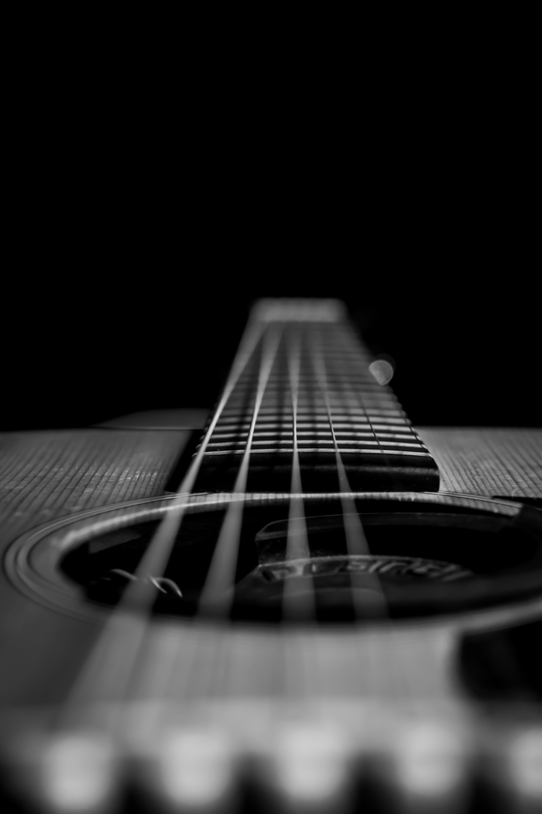

# Don't Let Your Dreams Be Dreams

## A Visual Argument 
This is a visual argument targeted at musicians to not give up on their passions. I personally had a phase where I let myself use the 'not enough time' excuse for not continuing to learn the guitar. Since I recently got back into it, I wanted to help convince others to not forget their passions as well.

Shia LaBeouf had a very popular motivational meme back in the day and the message was adjacent to mine, so its context incorporated very nicely into my visual argument.

 

--------------
## Reflection

 

----------
## Credits

Photo by <a href="https://unsplash.com/@danesduet?utm_source=unsplash&utm_medium=referral&utm_content=creditCopyText">Daniel Olah</a> on <a href="https://unsplash.com/s/photos/space?utm_source=unsplash&utm_medium=referral&utm_content=creditCopyText">Unsplash</a>

 

  Photo by <a href="https://unsplash.com/@jordansteranka?utm_source=unsplash&utm_medium=referral&utm_content=creditCopyText">Jordan Steranka</a> on <a href="https://unsplash.com/s/photos/sunset?utm_source=unsplash&utm_medium=referral&utm_content=creditCopyText">Unsplash</a>
  

 

<a href='https://vimeo.com/125095515'>#INTRODUCTIONS (2015)</a>

By LaBeouf, Rönkkö & Turner in collaboration with Central Saint Martins BA Fine Art 2015 students.
Released under a Creative Commons Attribution Non-Commercial Share-Alike licence.

 

Photo by <a href="https://unsplash.com/@louishansel?utm_source=unsplash&utm_medium=referral&utm_content=creditCopyText">Louis Hansel</a> on <a href="https://unsplash.com/s/photos/guitar?utm_source=unsplash&utm_medium=referral&utm_content=creditCopyText">Unsplash</a>
  

 

Photo by <a href="https://unsplash.com/@arstyy?utm_source=unsplash&utm_medium=referral&utm_content=creditCopyText">Austin Neill</a> on <a href="https://unsplash.com/s/photos/music?utm_source=unsplash&utm_medium=referral&utm_content=creditCopyText">Unsplash</a>
  
   
  

  Photo by <a href="https://unsplash.com/@luwadlinbosman?utm_source=unsplash&utm_medium=referral&utm_content=creditCopyText">Luwadlin Bosman</a> on <a href="https://unsplash.com/s/photos/guitar?utm_source=unsplash&utm_medium=referral&utm_content=creditCopyText">Unsplash</a>
  